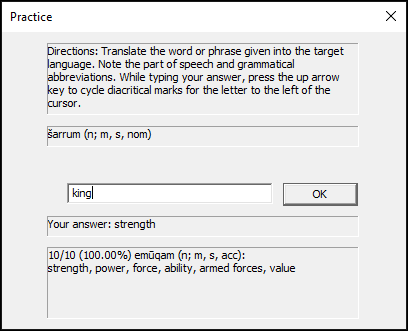

# Akkadian Words

This is a study tool that I made to help me learn Akkadian. It is a Win32 application that creates a dialog box with a word, text box, submit button, and summary at the bottom. The program presents a word or short phrase (either in Akkadian or English) and you enter a translation in the text box. If the translation is correct, you get a point; the score is shown at the bottom with the previous word and your previous answer. You can enter characters with diacritical marks by pressing the up arrow key in the text box.

The repo comes with a _dict.dat_ file (UTF8)
containing several Akkadian -> English definitions (following John Huehnergard's _A Grammar
of Akkadian_). The tool expects a _dict.dat_ in the working directory. It loads the dictionary
and generates a corresponding English -> Akkadian dictionary from the given definitions.

## Todo

The program is complete until I find bugs or until I learn more Akkadian. I need to add several more chapters of vocab from the book to _dict.dat_.
